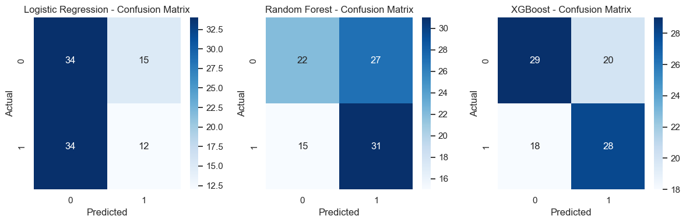
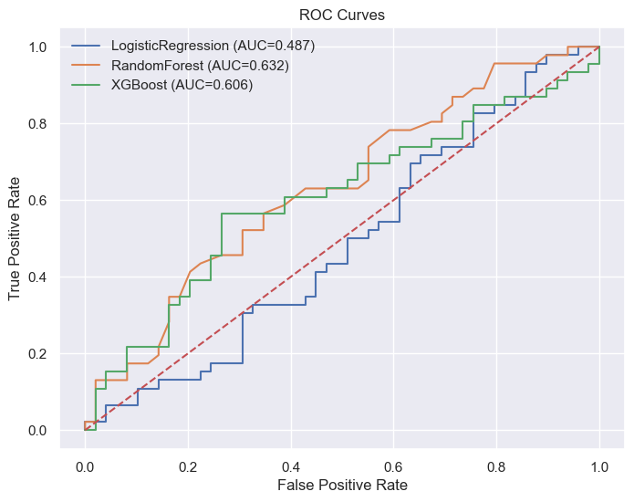
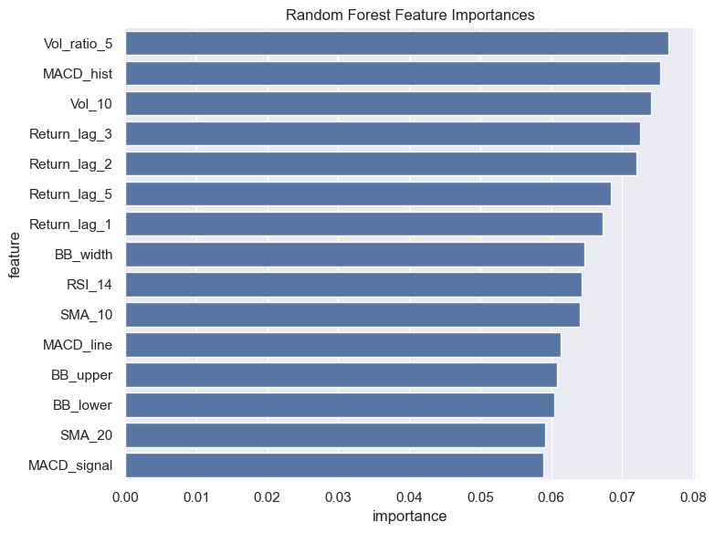
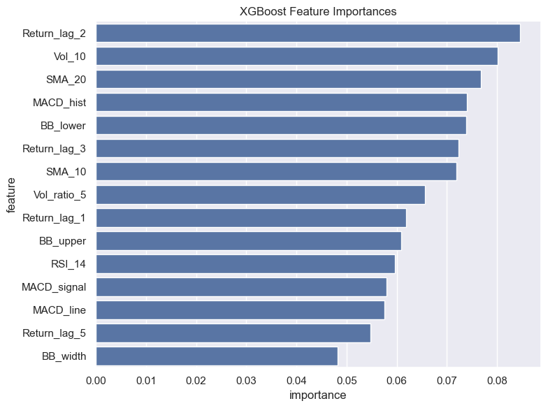
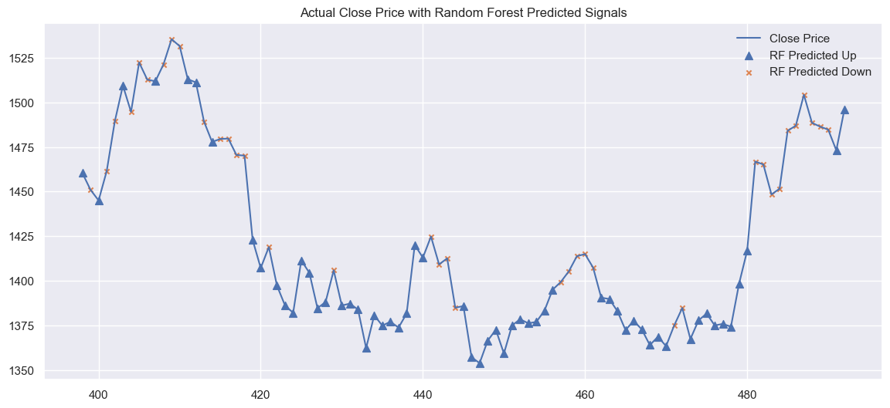

# Predicting Next-Day Stock Direction with Machine Learning

A small end-to-end ML project that tries to answer a deceptively simple question: **will tomorrow's closing price be higher or lower than today's?** I picked Reliance Industries (`RELIANCE.NS`) as the test stock, pulled two years of daily price data, built a handful of technical indicators, and trained three classifiers to see how well they could call the direction of the next day's move.

Spoiler: this is a genuinely hard problem, and the results reflect that honestly rather than overselling anything. More on that below.

---

## 1. What this project does

1. Pulls ~2 years of daily OHLCV data for RELIANCE.NS from Yahoo Finance (`yfinance`).
2. Engineers a set of technical indicators from the raw price series.
3. Labels each day as `1` (price went up the next day) or `0` (it didn't).
4. Splits the data chronologically (no shuffling — that would leak future information into training).
5. Trains and compares three classifiers: **Logistic Regression**, **Random Forest**, and **XGBoost**.
6. Evaluates each model with accuracy, precision, recall, F1, and ROC-AUC, and visualizes the results.

---

## 2. Data

- **Source:** Yahoo Finance via `yfinance`
- **Ticker:** `RELIANCE.NS`
- **Period:** ~2 years (Nov 2023 – Nov 2025), 474 trading days after cleaning
- **Fields:** Open, High, Low, Close, Volume
- Missing values were forward/backward filled, and a rolling z-score check confirmed there were no extreme outliers (>6σ) in the closing price series.

## 3. Features

Rather than feeding raw prices into the models (which don't generalize well across different price scales), I engineered indicators that capture trend, momentum, and volatility:

| Category | Features |
|---|---|
| Trend | SMA-10, SMA-20 |
| Momentum | RSI-14, MACD line, MACD signal, MACD histogram |
| Volatility | Bollinger Bands (upper/lower/width) |
| Volume | Vol-10, Vol ratio (5-day) |
| Returns | Lagged returns (1, 2, 3, 5 days) |

The target label is simple: `1` if tomorrow's close is higher than today's, `0` otherwise, computed by shifting the `Close` column by one day.

Data was split **chronologically** — 80% train (379 rows) / 20% test (95 rows) — to avoid leaking future information into the training set, which is a common mistake in time-series ML.

---

## 4. Models

Three classifiers were trained on the same feature set:

- **Logistic Regression** — a simple linear baseline, trained on standardized features.
- **Random Forest** — 200 trees, trained on raw (unscaled) features.
- **XGBoost** — gradient-boosted trees, also on unscaled features.

## 5. Results

| Model | Accuracy | Precision | Recall | F1 Score |
|---|---|---|---|---|
| Logistic Regression | 0.484 | 0.444 | 0.261 | 0.329 |
| Random Forest | 0.558 | 0.535 | 0.674 | 0.596 |
| XGBoost | **0.600** | 0.583 | 0.609 | 0.596 |

XGBoost edges out Random Forest on raw accuracy, and both tree-based models comfortably beat Logistic Regression, which barely does better than a coin flip. That's a meaningful pattern in itself — it suggests the relationship between these indicators and next-day direction is non-linear, which linear regression simply can't capture.

### Confusion matrices

How each model's predictions broke down on the 95-day test set:

Logistic Regression's confusion matrix is telling — it predicted "down" (0) far more often than "up," and got both classes roughly right only about half the time. Random Forest swings the other way, over-predicting "up" but catching more of the actual up-moves (higher recall). XGBoost is the most balanced of the three.

### ROC curves

The AUC scores tell the same story as the accuracy table: Logistic Regression (AUC = 0.487) sits almost exactly on the diagonal, meaning it's barely better than random guessing. Random Forest (AUC = 0.632) and XGBoost (AUC = 0.606) both show real, if modest, separation between the two classes.

### What drove the predictions

Feature importances from the tree-based models point to a fairly consistent story — momentum and volume-based features matter more than raw price levels:

Across both models, **lagged returns, volume ratio, MACD histogram, and short-term SMAs** consistently rank near the top. This lines up with financial intuition — recent momentum and volume shifts tend to carry more short-term predictive signal than static price bands.

### Predictions vs. actual price movement

To get a feel for *when* the model does well and when it doesn't, here's Random Forest's predicted direction overlaid on the actual closing price for the test window:

The model tracks the broad up/down swings reasonably well during clear trending stretches, but — like most short-term direction models — it struggles around choppy, sideways periods where the "right" label is close to a coin flip anyway.

---

## 6. Honest takeaways

- **XGBoost and Random Forest (60% and 56% accuracy) meaningfully outperform Logistic Regression (48%)**, confirming that non-linear models are better suited to this kind of noisy, interacting feature set.
- These accuracy numbers are **statistical prediction quality, not trading performance.** A 60% directional hit rate does *not* translate directly into profitable trading — transaction costs, slippage, and position sizing are a whole separate problem this project doesn't touch.
- Stock price movements are inherently noisy over a one-day horizon, and the feature set here is fairly small. This is expected, not a bug.

### Where this could go next

- Time-series cross-validation (rather than a single train/test split) for more robust performance estimates.
- Hyperparameter tuning (the models here use mostly default/moderate settings).
- Richer features — fundamental data, sentiment, sector-relative signals.
- Sequence models (LSTM/GRU/Transformers) that can directly model temporal dependencies instead of relying on hand-engineered lag features.

---

## 7. Pipeline summary

| Stage | What happens | Tools |
|---|---|---|
| Data acquisition | Pull 2 years of daily OHLCV data | `yfinance` |
| Feature engineering | Compute RSI, SMA, MACD, Bollinger Bands, returns | `pandas`, `numpy` |
| Labeling | Binary next-day direction via shifted Close | `pandas.shift()` |
| Data splitting | Chronological 80/20 train/test split | `scikit-learn` |
| Model training | Logistic Regression, Random Forest, XGBoost | `scikit-learn`, `xgboost` |
| Evaluation | Accuracy, Precision, Recall, F1, ROC-AUC, confusion matrices | `scikit-learn.metrics`, `matplotlib`, `seaborn` |

---

## 8. Tech stack

`Python` · `pandas` / `numpy` · `yfinance` · `scikit-learn` · `xgboost` · `matplotlib` / `seaborn`

---

*This project was built as a hands-on exercise in applying a full ML workflow — data acquisition, feature engineering, model comparison, and honest evaluation — to a real-world, genuinely difficult prediction problem.*
